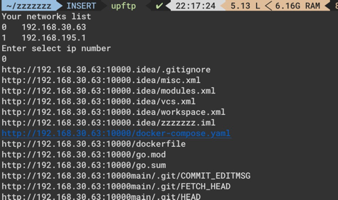

<h1 align="center">
  <br>
  <a href="https://github.com/zy84338719/upftp" alt="logo" ></a>
  <br>
  upftp
  <br>
</h1>

<div align="center">
  <h4>一个现代化的跨平台多协议文件共享服务器 | A modern cross-platform multi-protocol file sharing server</h4>
  <p>支持 HTTP、FTP、WebDAV、NFS 和 MCP 协议，提供现代化 Web 界面和丰富的文件预览功能</p>
  <p>Supports HTTP, FTP, WebDAV, NFS and MCP protocols, with modern web interface and rich file preview capabilities</p>
</div>

<p align="center">
  <a href="https://github.com/zy84338719/upftp/actions/workflows/build.yml">
    
  </a>
  <a href="https://goreportcard.com/report/github.com/zy84338719/upftp">
    
  </a>
  <a href="https://github.com/zy84338719/upftp/releases">
    
  </a>
  <a href="https://github.com/zy84338719/upftp/blob/main/LICENSE.txt">
    
  </a>
  <a href="https://github.com/zy84338719/upftp/stargazers">
    
  </a>
  <a href="https://github.com/zy84338719/upftp/network/members">
    
  </a>
</p>

<p align="center">
  <a href="#-主要特性">特性</a> •
  <a href="#-截图展示">截图</a> •
  <a href="#-快速开始">安装</a> •
  <a href="#-使用方法">使用</a> •
  <a href="#-常见问题">FAQ</a> •
  <a href="#-贡献">贡献</a>
</p>

[English](#english) | [中文](#中文)

---

# 中文

## 📸 截图展示

<div align="center">
  
  <p><em>Web界面预览</em></p>
</div>

<div align="center">
  
  <p><em>命令行界面预览</em></p>
</div>

## ✨ 主要特性

### 🌐 现代化Web界面
- 响应式设计，支持移动设备
- 实时文件搜索功能
- 直观的文件类型图标
- 优雅的预览模态框
- **🌍 多语言支持**: 自动检测浏览器语言，支持中英文切换
- **🎨 新界面设计**: 页面标题更新为 "AI-First File Server"，添加版本徽章和功能展示栏
- **📱 移动优化**: 改进的移动端响应式设计，添加用于移动访问的 QR 码按钮
- **📤 上传界面**: 改进的上传部分 UI

### 🎨 智能语言体验
- **自动语言检测**: 根据浏览器语言自动选择中文或英文界面
- **手动语言切换**: 一键切换中英文，实时生效无需刷新
- **语言偏好记忆**: 自动保存用户语言选择，下次访问时自动应用
- **完整界面翻译**: 所有文本元素均支持中英文显示

### 🎥 丰富的文件预览
- **图片**: JPG, PNG, GIF, SVG, WebP, BMP, ICO, HEIC, HEIF, AVIF, TIFF 等
- **视频**: MP4, AVI, MOV, WebM, MKV, M4V, MPEG, 3GP, OGV 等
- **音频**: MP3, WAV, FLAC, AAC, OGG, M4A, WMA, OPUS, AIFF, APE 等  
- **文本/代码**: 支持语法高亮的多种编程语言，包括 Vue, Svelte, Dart, Kotlin 等
- **文档**: PDF可在浏览器预览，Office文档提供下载
- **容器格式**: Dockerfile, Makefile 等

### 🚀 多协议支持
- **HTTP服务器**: 现代Web界面，支持浏览器访问
- **FTP服务器**: 传统FTP协议，支持各种FTP客户端
- **MCP服务器**: Model Context Protocol，支持AI集成
- **WebDAV服务器**: 支持WebDAV协议
- **NFS服务器**: 支持NFS协议
- 独立端口配置，可单独启用

### 🔧 便捷的管理
- **交互式命令行界面**: 带有 ASCII 艺术标志横幅和 emoji 图标的改进命令菜单
- **文件搜索和列表管理**: 改进的文件列表，带有分页（最多 20 项）
- **下载链接生成**: 增强的下载示例，带有 MCP 集成信息
- **实时文件系统刷新**
- **服务器状态**: 新的服务器状态和关于信息屏幕
- **版本信息**: 版本信息命令（`v` 或 `version`）

### 📝 配置增强
- **改进的配置文件**: 带有详细注释和使用示例
- **配置路径跟踪**: 配置路径跟踪和显示
- **更好的组织**: 更好的部分组织，带有视觉分隔符

### 📊 更好的日志记录
- **改进的日志格式**: 带有视觉指示器
- **颜色编码**: 带有项目符号的颜色编码日志级别
- **信息丰富**: 更多信息丰富的启动消息

### 🔒 安全与配置
- **路径验证**: 更好的上传路径验证
- **错误处理**: 增强的错误处理

### 🌍 跨平台支持
- **Linux**: amd64, arm64
- **Windows**: amd64, 386  
- **macOS**: Intel, Apple Silicon

## 🚀 快速开始

### 方式一：包管理器安装（推荐）

#### macOS (Homebrew)

```bash
# 添加 tap
brew tap zy84338719/homebrew-tap

# 安装
brew install upftp
```

#### Windows (Scoop)

```powershell
# 添加 bucket
scoop bucket add upftp https://github.com/zy84338719/scoop-bucket

# 安装
scoop install upftp
```

### 方式二：直接下载

从 [Releases 页面](https://github.com/zy84338719/upftp/releases) 下载对应平台的预编译二进制：

```bash
# Linux (amd64)
wget https://github.com/zy84338719/upftp/releases/latest/download/upftp_linux_amd64.tar.gz
tar -xzf upftp_linux_amd64.tar.gz
chmod +x upftp
sudo mv upftp /usr/local/bin/

# Linux (arm64)
wget https://github.com/zy84338719/upftp/releases/latest/download/upftp_linux_arm64.tar.gz
tar -xzf upftp_linux_arm64.tar.gz
chmod +x upftp
sudo mv upftp /usr/local/bin/

# macOS (Apple Silicon)
wget https://github.com/zy84338719/upftp/releases/latest/download/upftp_darwin_arm64.tar.gz
tar -xzf upftp_darwin_arm64.tar.gz
chmod +x upftp
sudo mv upftp /usr/local/bin/

# macOS (Intel)
wget https://github.com/zy84338719/upftp/releases/latest/download/upftp_darwin_amd64.tar.gz
tar -xzf upftp_darwin_amd64.tar.gz
chmod +x upftp
sudo mv upftp /usr/local/bin/
```

### 方式二：编译安装

需要 **Go 1.24+** 环境。

#### macOS

```bash
# 安装 Go
brew install go

# 克隆并编译
git clone https://github.com/zy84338719/upftp.git
cd upftp
make deps && make build

# 安装到系统路径
sudo cp upftp /usr/local/bin/
```

#### Ubuntu / Debian

```bash
# 安装 Go（推荐使用官方版本）
wget https://go.dev/dl/go1.24.1.linux-amd64.tar.gz
sudo tar -C /usr/local -xzf go1.24.1.linux-amd64.tar.gz
export PATH=$PATH:/usr/local/go/bin

# 克隆并编译
git clone https://github.com/zy84338719/upftp.git
cd upftp
make deps && make build

# 安装到系统路径
sudo cp upftp /usr/local/bin/
```

#### CentOS / RHEL / Fedora

```bash
# 安装 Go
wget https://go.dev/dl/go1.24.1.linux-amd64.tar.gz
sudo tar -C /usr/local -xzf go1.24.1.linux-amd64.tar.gz
export PATH=$PATH:/usr/local/go/bin

# 安装 git（如未安装）
sudo yum install -y git   # CentOS/RHEL
# sudo dnf install -y git # Fedora

# 克隆并编译
git clone https://github.com/zy84338719/upftp.git
cd upftp
make deps && make build

# 安装到系统路径
sudo cp upftp /usr/local/bin/
```

#### 交叉编译其他平台

```bash
# 查看所有构建目标
make help

# 编译所有平台（Linux/macOS/Windows, amd64/arm64）
make build-all

# 编译结果在 dist/ 目录
ls dist/
```

### 基本使用

```bash
# 使用默认配置启动
./upftp

# 指定端口和目录
./upftp -p 8888 -d /path/to/share

# 启用FTP服务器
./upftp -enable-ftp -user admin -pass mypassword

# 启用MCP服务器 (AI集成)
./upftp -enable-mcp

# 自动选择网络接口（适合脚本使用）
./upftp -auto
```

### 完整参数

```bash
upftp [选项]

选项：
    -p <port>       HTTP服务器端口 (默认: 10000)
    -ftp <port>     FTP服务器端口 (默认: 2121)
    -webdav <port>  WebDAV服务器端口 (默认: 8080)
    -nfs <port>     NFS服务器端口 (默认: 2049)
    -d <dir>        共享目录 (默认: 当前目录)
    -auto           自动选择第一个可用网络接口
    -enable-ftp     启用FTP服务器
    -enable-webdav  启用WebDAV服务器
    -enable-nfs     启用NFS服务器
    -enable-mcp     启用MCP服务器 (AI集成)
    -user <name>    FTP用户名 (默认: admin)
    -pass <pass>    FTP密码 (默认: admin)
    -h              显示帮助信息
```

### 访问方式

启动后可通过以下方式访问：

1. **Web浏览器**: `http://你的IP:端口`
2. **FTP客户端**: `ftp://你的IP:FTP端口`  
3. **WebDAV客户端**: `http://你的IP:WebDAV端口`
4. **NFS客户端**: `你的IP:/share`
5. **命令行下载**: `curl -O http://你的IP:端口/download/文件名`

### MCP 集成

upftp 支持 [Model Context Protocol (MCP)](https://modelcontextprotocol.io/)，可以让 AI 助手（如 Claude）直接访问和操作共享目录中的文件。

#### 启用 MCP

```bash
./upftp -enable-mcp -d /path/to/share
```

#### MCP 工具列表

| 工具名称 | 描述 |
|---------|------|
| `list_files` | 列出指定路径下的文件和目录 |
| `get_file_info` | 获取文件或目录的详细信息 |
| `read_file` | 读取文本文件内容 |
| `download_file` | 获取文件的下载链接和 Base64 编码内容 |
| `search_files` | 搜索匹配模式的文件 |
| `get_directory_tree` | 获取目录树结构 |
| `start_server` | 启动 HTTP/FTP 服务器供局域网文件共享 |
| `stop_server` | 停止 HTTP/FTP 服务器 |
| `get_server_status` | 获取服务器状态和访问 URL |
| `set_share_directory` | 更改共享目录 |

#### 使用场景

AI 助手可以：
1. 通过 `start_server` 快速启动一个局域网文件服务器
2. 返回访问 URL 给用户，供其他用户下载文件
3. 通过 `stop_server` 随时停止服务
4. 通过 `set_share_directory` 动态切换共享目录

#### 在 Claude Desktop 中配置

在 Claude Desktop 配置文件中添加：

**macOS**: `~/Library/Application Support/Claude/claude_desktop_config.json`
**Windows**: `%APPDATA%\Claude\claude_desktop_config.json`

```json
{
  "mcpServers": {
    "upftp": {
      "command": "/path/to/upftp",
      "args": ["-enable-mcp", "-d", "/path/to/share"]
    }
  }
}
```

## 🛠️ 从源码构建

需要 Go 1.24 或更高版本。详见上方 [编译安装](#方式二编译安装) 章节。

```bash
git clone https://github.com/zy84338719/upftp.git
cd upftp
make deps && make build
```

## 🔧 技术栈

- **语言**: Go 1.24+
- **Web框架**: 标准库 `net/http`
- **FTP服务器**: 自定义实现
- **WebDAV服务器**: 自定义实现
- **NFS服务器**: 基于 go-nfs 库
- **前端**: Vue 3 + TypeScript + Vite
- **构建工具**: Make, GoReleaser, npm
- **CI/CD**: GitHub Actions

## 📖 详细文档

- [安装指南](INSTALL.md) - 详细的安装和配置说明
- [使用示例](EXAMPLES.md) - 各种使用场景示例
- [更新日志](CHANGELOG.md) - 版本更新记录

## ❓ 常见问题

<details>
<summary><b>如何更改默认端口？</b></summary>

使用 `-p` 参数指定HTTP端口：
```bash
./upftp -p 8080
```
</details>

<details>
<summary><b>如何设置FTP密码？</b></summary>

使用 `-user` 和 `-pass` 参数：
```bash
./upftp -enable-ftp -user myuser -pass mypassword
```
</details>

<details>
<summary><b>如何在后台运行？</b></summary>

在Linux系统上使用systemd服务：
```bash
sudo systemctl start upftp
sudo systemctl enable upftp  # 开机自启
```

或者在命令行使用 `nohup`：
```bash
nohup ./upftp -auto > upftp.log 2>&1 &
```
</details>

<details>
<summary><b>端口被占用怎么办？</b></summary>

检查端口占用：
```bash
# Linux/macOS
lsof -i :10000
netstat -tlnp | grep 10000

# 使用其他端口
./upftp -p 10001
```
</details>

<details>
<summary><b>如何配置防火墙？</b></summary>

```bash
# Ubuntu/Debian (ufw)
sudo ufw allow 10000/tcp
sudo ufw allow 2121/tcp  # 如果启用了FTP

# CentOS/RHEL (firewalld)
sudo firewall-cmd --permanent --add-port=10000/tcp
sudo firewall-cmd --permanent --add-port=2121/tcp
sudo firewall-cmd --reload
```
</details>

<details>
<summary><b>支持哪些文件类型的预览？</b></summary>

- **图片**: JPG, PNG, GIF, SVG, WebP, BMP, ICO
- **视频**: MP4, AVI, MOV, WebM, MKV, M4V
- **音频**: MP3, WAV, FLAC, AAC, OGG, M4A
- **代码/文本**: 支持语法高亮的多种编程语言
- **文档**: PDF可在浏览器预览，Office文档提供下载
</details>

更多问题请查看 [EXAMPLES.md](EXAMPLES.md) 或提交 [Issue](https://github.com/zy84338719/upftp/issues)。

## 🔒 安全建议

1. **更改默认密码**: 使用 `-user` 和 `-pass` 设置强密码
2. **网络隔离**: 仅在可信网络环境中使用，或在防火墙中限制访问IP
3. **文件权限**: 注意共享目录的读写权限设置
4. **HTTPS支持**: 生产环境建议配合反向代理（如Nginx）使用HTTPS

## 🤝 贡献

欢迎贡献代码、报告Bug或提出新功能建议！

### 贡献方式

1. Fork 本仓库
2. 创建特性分支 (`git checkout -b feature/AmazingFeature`)
3. 提交更改 (`git commit -m 'Add some AmazingFeature'`)
4. 推送到分支 (`git push origin feature/AmazingFeature`)
5. 开启 Pull Request

### 开发指南

```bash
# 克隆仓库
git clone https://github.com/zy84338719/upftp.git
cd upftp

# 安装依赖
make deps

# 运行测试
make test

# 本地构建
make build

# 代码格式化
make fmt
```

## 📝 待办事项

- [ ] 添加HTTPS支持
- [ ] 添加用户认证系统
- [ ] 支持文件上传
- [ ] 添加WebDAV支持
- [ ] 国际化支持更多语言
- [ ] 添加文件缩略图缓存
- [ ] 支持自定义主题

## ⭐ Star History

<a href="https://github.com/zy84338719/upftp/stargazers">
  
</a>

## 📄 许可证

本项目采用 MIT 许可证 - 详见 [LICENSE.txt](LICENSE.txt) 文件。

## 🙏 致谢

- 感谢所有贡献者的付出
- 感谢开源社区的支持

---

# English

## 📸 Screenshots

<div align="center">
  
  <p><em>Web Interface Preview</em></p>
</div>

<div align="center">
  
  <p><em>Command Line Interface Preview</em></p>
</div>

## ✨ Key Features

### 🌐 Modern Web Interface
- Responsive design with mobile support
- Real-time file search functionality  
- Intuitive file type icons
- Elegant preview modal dialogs
- **🌍 Multi-language Support**: Auto-detect browser language, supports Chinese/English switching
- **🎨 New Interface Design**: Updated page title to "AI-First File Server", added version badge and feature showcase bar
- **📱 Mobile Optimization**: Improved responsive design for mobile, added QR code button for mobile access
- **📤 Upload Interface**: Enhanced upload section UI

### 🎨 Smart Language Experience
- **Auto Language Detection**: Automatically selects Chinese or English based on browser language
- **Manual Language Switching**: One-click switch between Chinese/English, takes effect immediately without refresh
- **Language Preference Memory**: Automatically saves user language choice, applies on next visit
- **Complete Interface Translation**: All text elements support Chinese/English display

### 🎥 Rich File Preview
- **Images**: JPG, PNG, GIF, SVG, WebP, BMP, ICO, HEIC, HEIF, AVIF, TIFF, etc.
- **Videos**: MP4, AVI, MOV, WebM, MKV, M4V, MPEG, 3GP, OGV, etc.
- **Audio**: MP3, WAV, FLAC, AAC, OGG, M4A, WMA, OPUS, AIFF, APE, etc.
- **Text/Code**: Syntax-highlighted code preview for multiple programming languages including Vue, Svelte, Dart, Kotlin, etc.
- **Documents**: PDF preview in browser, Office document download support
- **Container Formats**: Dockerfile, Makefile, etc.

### 🚀 Multi-Protocol Support  
- **HTTP Server**: Modern web interface for browser access
- **FTP Server**: Traditional FTP protocol for FTP clients
- **MCP Server**: Model Context Protocol for AI integration
- **WebDAV Server**: Support for WebDAV protocol
- **NFS Server**: Support for NFS protocol
- Independent port configuration, can be enabled separately

### 🔧 Convenient Management
- **Interactive Command-line Interface**: Beautiful ASCII art logo banner and improved command menu with emoji icons
- **File Search and Listing Management**: Improved file listing with pagination (max 20 items)
- **Download Link Generation**: Enhanced download examples with MCP integration info
- **Real-time File System Refresh**
- **Server Status**: New server status and about information screens
- **Version Info**: Version info command (`v` or `version`)

### 📝 Configuration Enhancements
- **Improved Configuration File**: Detailed comments and usage examples
- **Configuration Path Tracking**: Configuration path tracking and display
- **Better Organization**: Better section organization with visual separators

### 📊 Better Logging
- **Improved Log Format**: Visual indicators in log format
- **Color-coded**: Color-coded log levels with bullet points
- **Informative**: More informative startup messages

### 🔒 Security & Configuration
- **Path Validation**: Better validation for upload paths
- **Error Handling**: Enhanced error handling

### 🌍 Cross-Platform Support
- **Linux**: amd64, arm64
- **Windows**: amd64, 386
- **macOS**: Intel, Apple Silicon

## 🚀 Quick Start

### Option 1: Package Manager (Recommended)

#### macOS (Homebrew)

```bash
# Add tap
brew tap zy84338719/tap

# Install
brew install upftp
```

#### Windows (Scoop)

```powershell
# Add bucket
scoop bucket add upftp https://github.com/zy84338719/scoop-bucket

# Install
scoop install upftp
```

### Option 2: Download Binary

Download the pre-built binary for your platform from the [Releases page](https://github.com/zy84338719/upftp/releases):

```bash
# Linux (amd64)
wget https://github.com/zy84338719/upftp/releases/latest/download/upftp_linux_amd64.tar.gz
tar -xzf upftp_linux_amd64.tar.gz
chmod +x upftp
sudo mv upftp /usr/local/bin/

# Linux (arm64)
wget https://github.com/zy84338719/upftp/releases/latest/download/upftp_linux_arm64.tar.gz
tar -xzf upftp_linux_arm64.tar.gz
chmod +x upftp
sudo mv upftp /usr/local/bin/

# macOS (Apple Silicon)
wget https://github.com/zy84338719/upftp/releases/latest/download/upftp_darwin_arm64.tar.gz
tar -xzf upftp_darwin_arm64.tar.gz
chmod +x upftp
sudo mv upftp /usr/local/bin/

# macOS (Intel)
wget https://github.com/zy84338719/upftp/releases/latest/download/upftp_darwin_amd64.tar.gz
tar -xzf upftp_darwin_amd64.tar.gz
chmod +x upftp
sudo mv upftp /usr/local/bin/
```

### Option 2: Build from Source

Requires **Go 1.24+**.

#### macOS

```bash
# Install Go
brew install go

# Clone and build
git clone https://github.com/zy84338719/upftp.git
cd upftp
make deps && make build

# Install to system path
sudo cp upftp /usr/local/bin/
```

#### Ubuntu / Debian

```bash
# Install Go (official)
wget https://go.dev/dl/go1.24.1.linux-amd64.tar.gz
sudo tar -C /usr/local -xzf go1.24.1.linux-amd64.tar.gz
export PATH=$PATH:/usr/local/go/bin

# Clone and build
git clone https://github.com/zy84338719/upftp.git
cd upftp
make deps && make build

# Install to system path
sudo cp upftp /usr/local/bin/
```

#### CentOS / RHEL / Fedora

```bash
# Install Go
wget https://go.dev/dl/go1.24.1.linux-amd64.tar.gz
sudo tar -C /usr/local -xzf go1.24.1.linux-amd64.tar.gz
export PATH=$PATH:/usr/local/go/bin

# Install git (if not installed)
sudo yum install -y git   # CentOS/RHEL
# sudo dnf install -y git # Fedora

# Clone and build
git clone https://github.com/zy84338719/upftp.git
cd upftp
make deps && make build

# Install to system path
sudo cp upftp /usr/local/bin/
```

#### Cross-compile for other platforms

```bash
# View all build targets
make help

# Build all platforms (Linux/macOS/Windows, amd64/arm64)
make build-all

# Output in dist/
ls dist/
```

### Basic Usage

```bash
# Start with default configuration
./upftp

# Specify port and directory  
./upftp -p 8888 -d /path/to/share

# Enable FTP server
./upftp -enable-ftp -user admin -pass mypassword

# Enable MCP server (AI integration)
./upftp -enable-mcp

# Auto-select network interface (suitable for scripts)
./upftp -auto
```

### Full Options

```bash
upftp [options]

Options:
    -p <port>       HTTP server port (default: 10000)
    -ftp <port>     FTP server port (default: 2121)  
    -webdav <port>  WebDAV server port (default: 8080)
    -nfs <port>     NFS server port (default: 2049)
    -d <dir>        Share directory (default: current directory)
    -auto           Automatically select first available network interface
    -enable-ftp     Enable FTP server
    -enable-webdav  Enable WebDAV server
    -enable-nfs     Enable NFS server
    -enable-mcp     Enable MCP server for AI integration
    -user <name>    FTP username (default: admin)
    -pass <pass>    FTP password (default: admin)
    -h              Show help message
```

### Access Methods

After startup, you can access via:

1. **Web Browser**: `http://your-ip:port`
2. **FTP Client**: `ftp://your-ip:ftp-port`
3. **WebDAV Client**: `http://your-ip:webdav-port`
4. **NFS Client**: `your-ip:/share`
5. **Command Line**: `curl -O http://your-ip:port/download/filename`

### MCP Integration

upftp supports [Model Context Protocol (MCP)](https://modelcontextprotocol.io/), enabling AI assistants (like Claude) to directly access and manage files in the shared directory.

#### Enable MCP

```bash
./upftp -enable-mcp -d /path/to/share
```

#### Available MCP Tools

| Tool Name | Description |
|-----------|-------------|
| `list_files` | List files and directories in a specified path |
| `get_file_info` | Get detailed information about a file or directory |
| `read_file` | Read the content of a text file |
| `download_file` | Get download URL and base64 encoded content for a file |
| `search_files` | Search for files matching a pattern |
| `get_directory_tree` | Get the directory tree structure |
| `start_server` | Start HTTP/FTP server for LAN file sharing |
| `stop_server` | Stop HTTP/FTP servers |
| `get_server_status` | Get current server status and access URLs |
| `set_share_directory` | Change the shared directory |

#### 使用场景

AI 助手可以：
1. 通过 `start_server` 快速启动一个局域网文件服务器
2. 返回访问 URL 给用户，供其他用户下载文件
3. 通过 `stop_server` 随时停止服务
4. 通过 `set_share_directory` 动态切换共享目录

#### Configure in Claude Desktop

Add to your Claude Desktop config file:

**macOS**: `~/Library/Application Support/Claude/claude_desktop_config.json`
**Windows**: `%APPDATA%\Claude\claude_desktop_config.json`

```json
{
  "mcpServers": {
    "upftp": {
      "command": "/path/to/upftp",
      "args": ["-enable-mcp", "-d", "/path/to/share"]
    }
  }
}
```

## 🛠️ Build from Source

Requires Go 1.24+. See [Build from Source](#option-2-build-from-source) above for per-platform instructions.

```bash
git clone https://github.com/zy84338719/upftp.git
cd upftp
make deps && make build
make package

# View all build options
make help
```

## 🔧 Tech Stack

- **Language**: Go 1.24+
- **Web Framework**: Standard library `net/http`
- **FTP Server**: Custom implementation
- **WebDAV Server**: Custom implementation
- **NFS Server**: Based on go-nfs library
- **Frontend**: Vue 3 + TypeScript + Vite
- **Build Tools**: Make, GoReleaser, npm
- **CI/CD**: GitHub Actions

## 📖 Documentation

- [Installation Guide](INSTALL.md) - Detailed installation and configuration
- [Usage Examples](EXAMPLES.md) - Various usage scenarios
- [Changelog](CHANGELOG.md) - Version update history

## ❓ FAQ

<details>
<summary><b>How to change the default port?</b></summary>

Use the `-p` parameter to specify HTTP port:
```bash
./upftp -p 8080
```
</details>

<details>
<summary><b>How to set FTP credentials?</b></summary>

Use `-user` and `-pass` parameters:
```bash
./upftp -enable-ftp -user myuser -pass mypassword
```
</details>

<details>
<summary><b>How to run in background?</b></summary>

Use systemd service on Linux:
```bash
sudo systemctl start upftp
sudo systemctl enable upftp  # Auto-start on boot
```

Or use `nohup` command:
```bash
nohup ./upftp -auto > upftp.log 2>&1 &
```
</details>

<details>
<summary><b>Port already in use?</b></summary>

Check port usage:
```bash
# Linux/macOS
lsof -i :10000
netstat -tlnp | grep 10000

# Use a different port
./upftp -p 10001
```
</details>

<details>
<summary><b>How to configure firewall?</b></summary>

```bash
# Ubuntu/Debian (ufw)
sudo ufw allow 10000/tcp
sudo ufw allow 2121/tcp  # If FTP is enabled

# CentOS/RHEL (firewalld)
sudo firewall-cmd --permanent --add-port=10000/tcp
sudo firewall-cmd --permanent --add-port=2121/tcp
sudo firewall-cmd --reload
```
</details>

<details>
<summary><b>What file types are supported for preview?</b></summary>

- **Images**: JPG, PNG, GIF, SVG, WebP, BMP, ICO
- **Videos**: MP4, AVI, MOV, WebM, MKV, M4V
- **Audio**: MP3, WAV, FLAC, AAC, OGG, M4A
- **Code/Text**: Multiple programming languages with syntax highlighting
- **Documents**: PDF preview in browser, Office documents available for download
</details>

For more questions, check [EXAMPLES.md](EXAMPLES.md) or submit an [Issue](https://github.com/zy84338719/upftp/issues).

## 🔒 Security Recommendations

1. **Change Default Password**: Use `-user` and `-pass` to set strong credentials
2. **Network Isolation**: Only use in trusted network environments or restrict access via firewall
3. **File Permissions**: Pay attention to read/write permissions on shared directories
4. **HTTPS Support**: For production, use with reverse proxy (e.g., Nginx) for HTTPS

## 🤝 Contributing

Contributions, bug reports, and feature requests are welcome!

### How to Contribute

1. Fork this repository
2. Create a feature branch (`git checkout -b feature/AmazingFeature`)
3. Commit your changes (`git commit -m 'Add some AmazingFeature'`)
4. Push to the branch (`git push origin feature/AmazingFeature`)
5. Open a Pull Request

### Development Guide

```bash
# Clone repository
git clone https://github.com/zy84338719/upftp.git
cd upftp

# Install dependencies
make deps

# Run tests
make test

# Local build
make build

# Code formatting
make fmt
```

## 📝 Roadmap

- [ ] Add HTTPS support
- [ ] Add user authentication system
- [ ] Support file upload
- [ ] Add WebDAV support
- [ ] Internationalization for more languages
- [ ] Add file thumbnail caching
- [ ] Support custom themes

## ⭐ Star History

<a href="https://github.com/zy84338719/upftp/stargazers">
  
</a>

## 📄 License

This project is licensed under the MIT License - see [LICENSE.txt](LICENSE.txt) for details.

## 🙏 Acknowledgments

- Thanks to all contributors for their efforts
- Thanks to the open source community for support

---

> GitHub [@zy84338719](https://github.com/zy84338719) &nbsp;&middot;&nbsp;
> Twitter [@murphyyi](https://twitter.com/murphyyi) &nbsp;&middot;&nbsp;
> Website [murphyyi.com](https://murphyyi.com)
