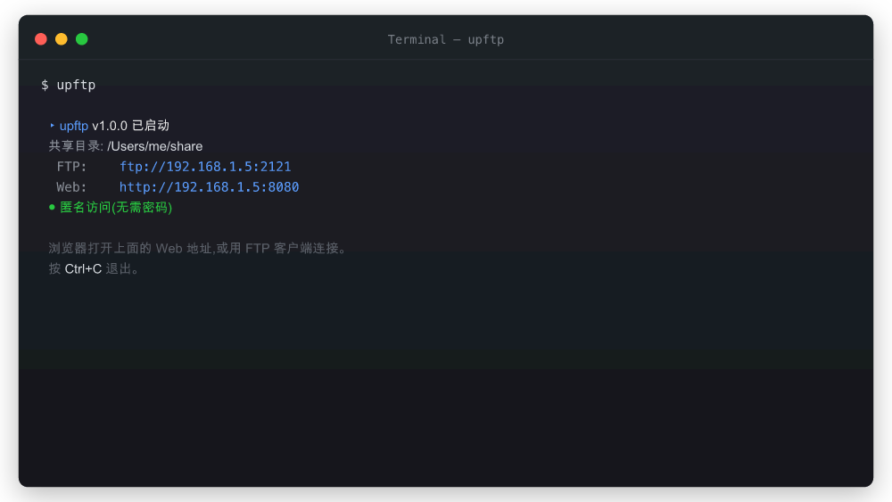
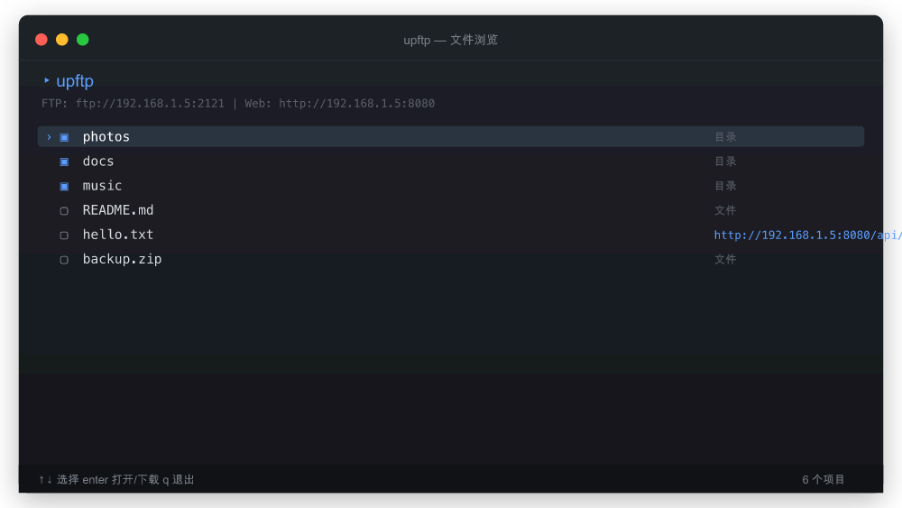
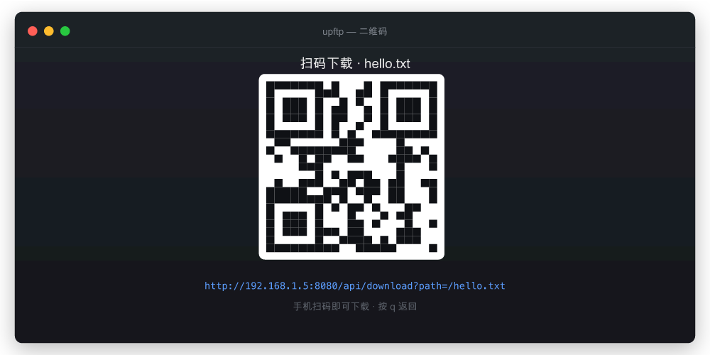
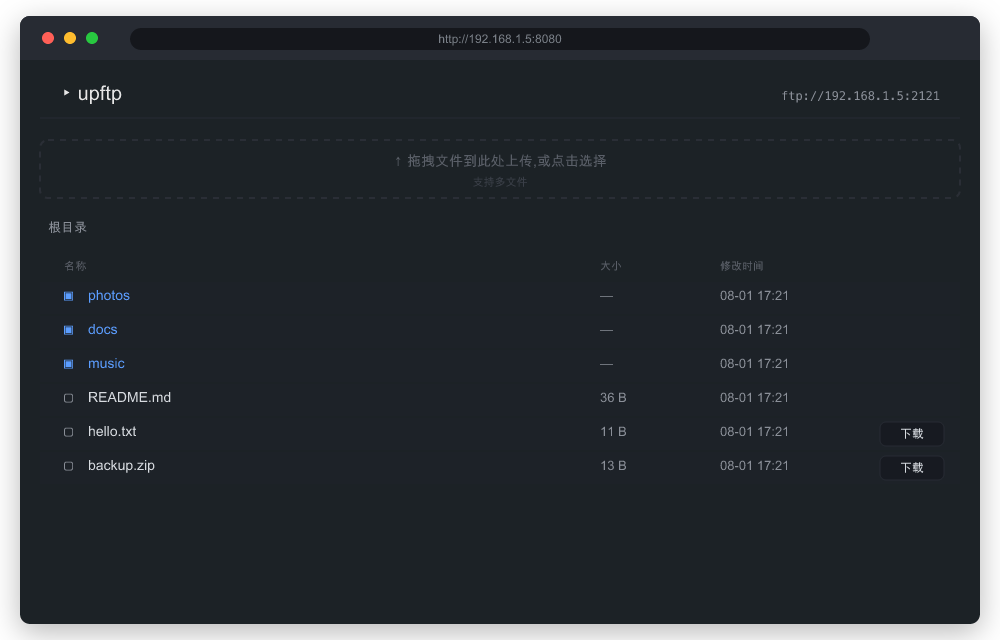
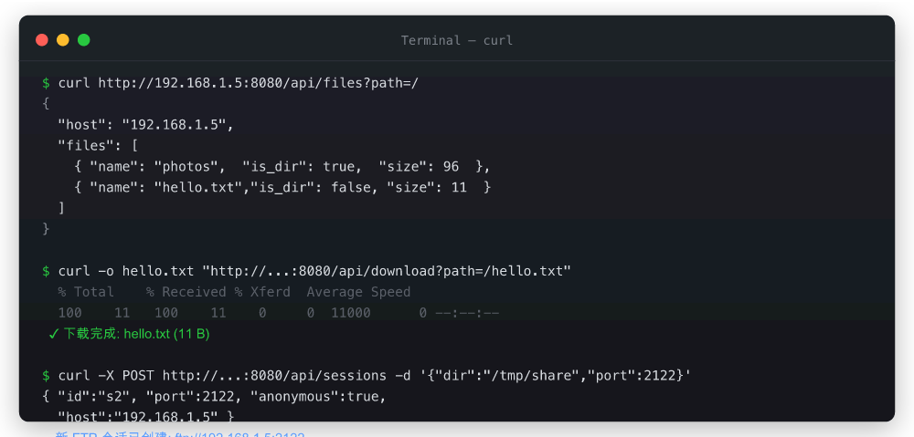

<div align="center">

# ▸ upftp

**快速、即开即用的 FTP 文件分享工具**

单二进制 · 跨平台 · FTP + REST API + Web 界面 · 默认匿名

[安装](#安装) · [使用](#快速开始) · [API](#rest-api) · [截图](#截图)

</div>

---

一个命令就能把任意目录变成可下载的 FTP/HTTP 文件服务。无需配置、无需 Go 环境,**默认匿名访问**,即开即用。

- 🚀 **一行启动** — `upftp` 即可分享当前目录,自动打印访问地址
- 📡 **完整 FTP 协议** — 被动/主动模式、上传下载、断点续传、MLSD
- 🌐 **REST API** — 程序可调用,支持动态创建/停止 FTP 会话
- 🖥️ **极简 Web 界面** — 浏览器访问,文件列表、拖拽上传、一键下载
- 📱 **TUI + 二维码** — 终端选中文件即显示二维码,手机扫码下载
- 🔒 **沙箱隔离** — 所有路径强制限制在共享根目录内
- 📦 **零运行时依赖** — 单二进制 ~11 MB,核心代码 2200 行

## 截图

<table>
  <tr>
    <td width="50%" align="center"><b>启动输出</b></td>
    <td width="50%" align="center"><b>TUI 文件浏览</b></td>
  </tr>
  <tr>
    <td></td>
    <td></td>
  </tr>
  <tr>
    <td align="center"><b>扫码下载(二维码)</b></td>
    <td align="center"><b>Web 界面</b></td>
  </tr>
  <tr>
    <td></td>
    <td></td>
  </tr>
  <tr>
    <td align="center" colspan="2"><b>命令行 / API 操作</b></td>
  </tr>
  <tr>
    <td colspan="2"></td>
  </tr>
</table>

## 安装

### 一行命令安装(推荐,无需 Go 环境)

**Linux / macOS:**
```bash
curl -fsSL https://github.com/zy84338719/upftp/raw/main/scripts/install.sh | bash
```

**Windows(PowerShell):**
```powershell
irm https://github.com/zy84338719/upftp/raw/main/scripts/install.ps1 | iex
```

脚本会自动检测系统与架构,从 [Releases](https://github.com/zy84338719/upftp/releases) 下载对应二进制、校验 SHA256 并安装到 PATH。默认装到 `~/.local/bin`(Linux/macOS)或 `%USERPROFILE%\.upftp\bin`(Windows),可用 `UPFTP_INSTALL_DIR` 自定义。

### 包管理器

**Homebrew(macOS / Linux):**
```bash
brew tap zy84338719/tap
brew install upftp
```

**Scoop(Windows):**
```powershell
scoop bucket add zy84338719 https://github.com/zy84338719/scoop-bucket
scoop install upftp
```

### 指定版本

```bash
curl -fsSL https://github.com/zy84338719/upftp/raw/main/scripts/install.sh | bash -s v1.0.0
```

### 从源码构建(需要 Go 1.22+)

```bash
git clone https://github.com/zy84338719/upftp.git
cd upftp && make build        # 当前平台
make build-all                # 全平台交叉编译
```

## 快速开始

```bash
# 分享当前目录(匿名、默认端口 2121 / 8080)
upftp
```

<p align="center">
  
</p>

```bash
# 指定目录、端口、密码
upftp -d ~/share -p 2121 -user me -pass secret

# 只读模式(仅下载,禁止上传/删除)
upftp -d ~/share --read-only

# 不启动 TUI(纯服务模式)
upftp -d ~/share --tui=false
```

## 命令行参数

| 参数 | 说明 | 默认值 |
|------|------|--------|
| `-d <dir>` | 共享目录 | 当前目录 |
| `-p <port>` | FTP 端口 | 2121 |
| `-http <port>` | HTTP/Web 端口 | 8080 |
| `-user <name>` | 用户名(留空=匿名) | 空 |
| `-pass <pass>` | 密码 | 空 |
| `-read-only` | 只读模式 | false |
| `-tui` | 启用终端界面 | true(TTY 时) |
| `-log <level>` | 日志级别 | info |
| `-version` | 打印版本 | |

配置文件查找顺序:`./upftp.yaml` → `~/.upftp/config.yaml` → `/etc/upftp/config.yaml`,命令行参数优先级最高。

## 三种使用形态

### 1. 人类使用 — FTP 客户端 / 浏览器 / TUI

```bash
# FTP 客户端(FileZilla、lftp、curl)
curl ftp://192.168.1.5:2121/hello.txt -o hello.txt

# 浏览器:访问 http://192.168.1.5:8080,拖拽上传/点击下载
# TUI:终端里选中文件显示二维码,手机扫码下载
```

### 2. REST API — 直接文件操作

```bash
# 列出文件
curl http://localhost:8080/api/files?path=/

# 下载
curl -o x.zip "http://localhost:8080/api/download?path=/x.zip"

# 上传(raw body)
curl -X POST "http://localhost:8080/api/upload?path=/dest.txt" --data-binary @local.txt

# 上传(multipart,浏览器表单格式)
curl -X POST http://localhost:8080/api/upload -F file=@local.txt -F path=/dest.txt

# 新建文件夹 / 删除
curl -X POST "http://localhost:8080/api/mkdir?path=/newdir"
curl -X DELETE "http://localhost:8080/api/files?path=/old.txt"
```

### 3. REST API — 动态管理 FTP 会话

```bash
# 创建一个新的 FTP 会话(可指定不同目录/端口)
curl -X POST http://localhost:8080/api/sessions \
  -d '{"dir":"/tmp/another","port":2122,"anonymous":true}'
# → {"id":"s2","port":2122,"anonymous":true,...}

# 列出所有会话
curl http://localhost:8080/api/sessions

# 停止某个会话
curl -X DELETE http://localhost:8080/api/sessions/s2
```

<p align="center">
  
</p>

## 认证

- **匿名模式**(默认):任何人可访问,适合局域网快速分享
- **密码模式**:`-user admin -pass secret`,FTP 需登录,HTTP 走 Basic Auth(同一份凭据)

## 架构

```
upftp 单二进制
├── FTP 服务器     internal/ftp/      手写协议,无外部依赖
├── HTTP API+Web   internal/http/     net/http + go:embed 单 HTML
├── TUI            internal/cli/      bubbletea
└── 共享核心       internal/core/     会话管理 / 文件操作 / 认证(FTP 与 HTTP 共用)
```

直接依赖仅 5 个:`yaml.v3`(配置)、`bubbletea` + `bubbles` + `lipgloss`(TUI)、`go-qrcode`(二维码)。

## 开发

```bash
make test          # 运行测试
make vet           # 静态检查
make build-all     # 交叉编译全部平台
```

## 发布

推送形如 `v1.0.0` 的 tag 即触发 [GitHub Actions](.github/workflows/release.yml),由 [Goreleaser](.goreleaser.yml) 自动构建 6 平台二进制并发布到 Releases,同时更新 Homebrew tap 与 Scoop bucket。

## 许可证

MIT
